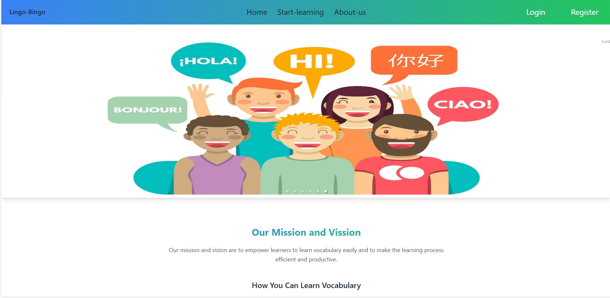

# 🎯 Lingo-Bingo: A Vocabulary Learning Web Application  

📚 **A fun and interactive way to enhance Japanese vocabulary!** 


## 🚀 Live Demo  
🔗 **[Lingo-Bingo Live](https://lingo-bingo-628fe.web.app/)**  

---

## 📌 Table of Contents  
- [Overview](#overview)  
- [Screenshot](#screenshot)  
- [Key Features](#key-features)  
- [Technologies Used](#technologies-used)  
- [Dependencies](#dependencies)  
- [Installation & Setup](#installation--setup)  
- [Resources & Links](#resources--links)  

---

## 📝 Overview  
Lingo-Bingo is a **vocabulary learning web application** designed to help learners improve their **Japanese vocabulary** through structured lessons, interactive tools, and engaging exercises. It provides an **easy-to-use** and **responsive** platform where beginners can efficiently memorize new words and improve pronunciation.  

---
## 🖼 Screenshot  



---

## ✨ Key Features  
✅ **Lesson Categories** – 10 structured categories for step-by-step learning.  
✅ **Pronunciation Support** – Integrated **audio features** to improve word pronunciation.  
✅ **Responsive Design** – Works on all devices (mobile, tablet, desktop).  
✅ **Video Tutorials** – Access engaging **video tutorials** for better learning.  
✅ **Profile Management** – Users can update their **profile** easily.  

---

## 🛠 Technologies Used  
- **Frontend:** HTML, Tailwind CSS, JavaScript, React  
- **Build Tool:** Vite  

---

## 📦 Dependencies  
The project uses the following npm packages:  

```bash
@eslint
@types/react-dom
@types/react
@vitejs/plugin-react
animate.css
aos
autoprefixer
axios
daisyui
eslint-plugin-react-hooks
eslint-plugin-react-refresh
eslint-plugin-react
eslint
firebase
globals
localforage
lottie-react
match-sorter
postcss
react-countup
react-dom
react-icons
react-rating-stars-component
react-responsive-carousel
react-router-dom
react
sort-by
sweetalert2
swiper
tailwindcss
vite
---
🛠 Installation & Setup
Follow these steps to run the project locally:

1️⃣ Clone the Repository
bash
Copy
Edit
git clone https://github.com/mdimranictiu/Lingo-Bingo.git
cd Lingo-Bingo
2️⃣ Install Dependencies
bash
Copy
Edit
npm install
3️⃣ Start the Development Server
bash
Copy
Edit
npm run dev
The project should now be running on localhost:5173 (or as specified in the terminal).

📚 Resources & Links
🌐 Live Demo
📖 React Documentation
🎨 Tailwind CSS Documentation
🔥 Firebase
